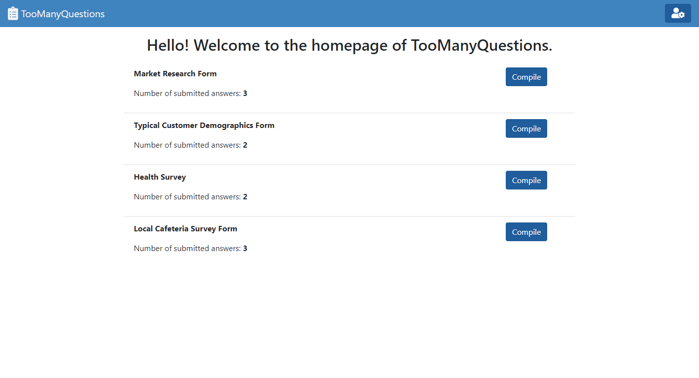
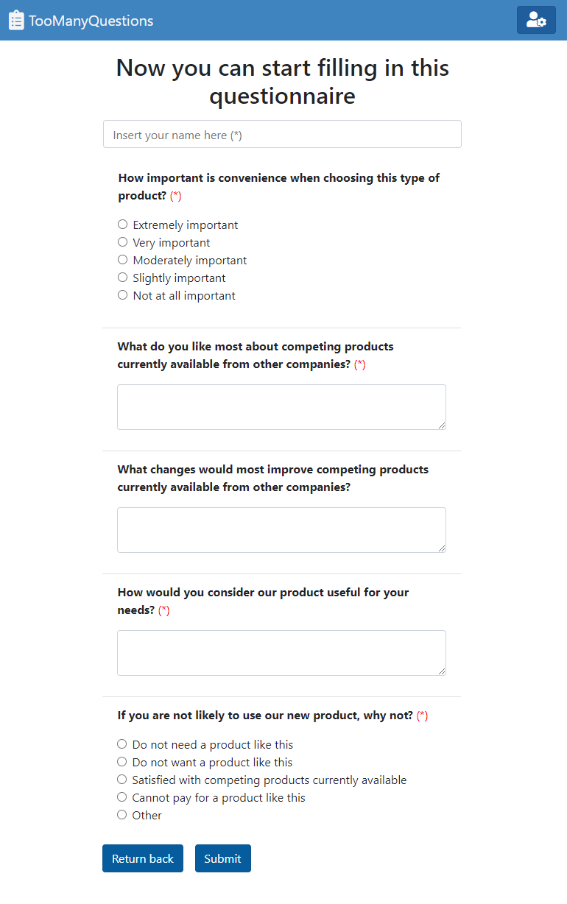
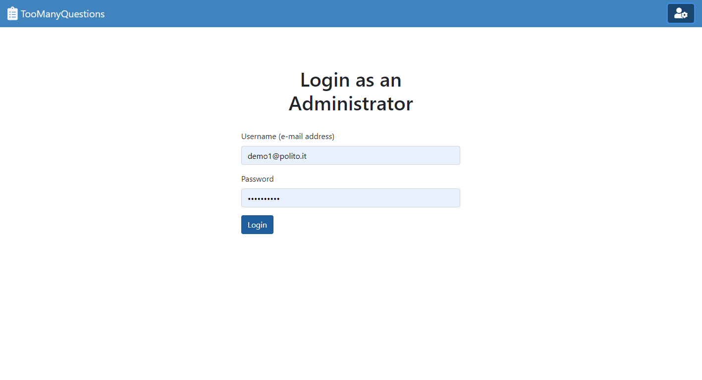
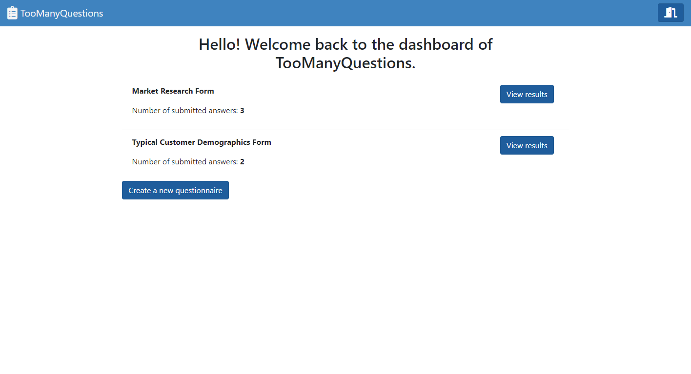
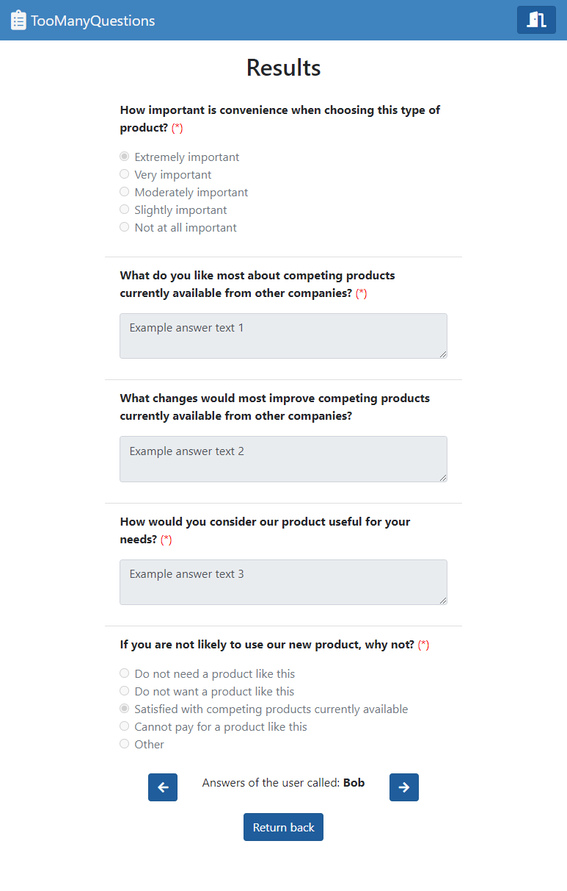
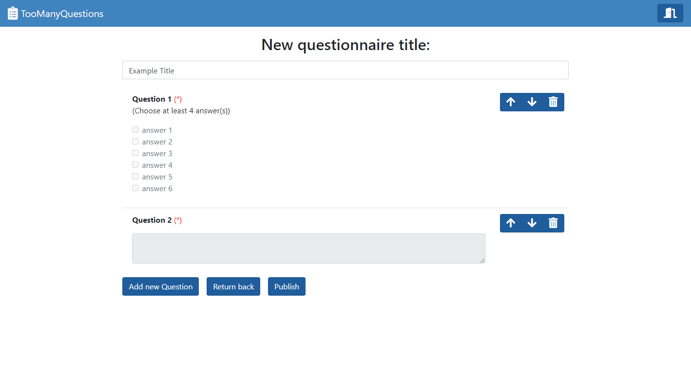
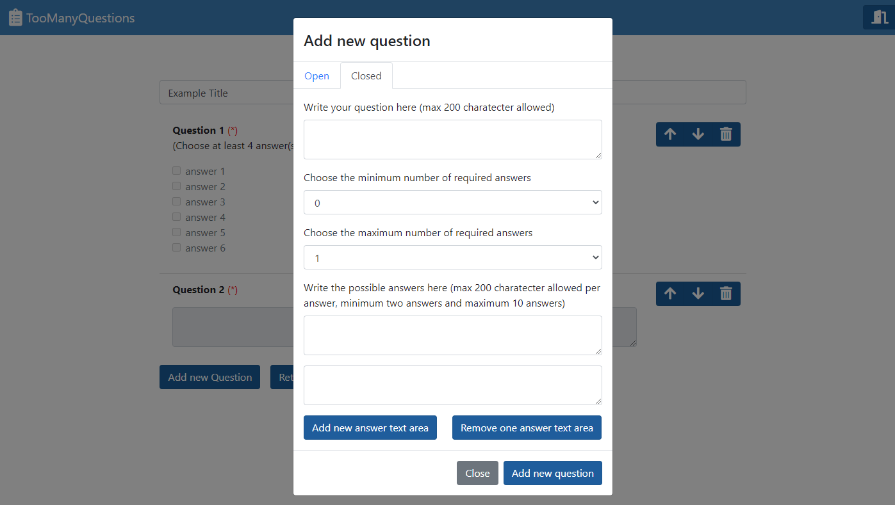

# Exam #1: "Questionario"

## Student: s287500 Massa Filippo

## React Client Application Routes

- **Route `/login`**: this route shows the login page useful to perform the login procedure.

- **Route `/`**: depending if your are logged in or not, this route shows you the homepage (list of all the available questionnaires) or the dashboard (list of the questionnaires created by the administrator).

- **Route `/questionnaire`**: this route shows all the questions related to a specific questionnaire and gives access to a total of three different functionalities expected from the application:
  - **Shows all the results of an existing questionnaire** _(only logged users from the dashboard)_.
  - **Fill in an already existing questionnaire** _(anyone from the homepage)_.
  - **Create a new questionnaire** _(only logged users from the dashboard)_.

- **Route `/questionnaire/add`**: this route shows a modal useful to add a new quesiton (route available only if a logged in user is currently creating a new questionnaire).
 
## User related APIs

- **Login**
  - HTTP Method: POST
  - URL: `/api/sessions`
  - Description: performs the login server procedure.
  - Request body:
    ```
        {
            "username": "test@example.com"
            "password": "VeryStrongPassword123",
        }
    ```
  - Response: `200 OK` (success) or `401 Unauthorized`.
  - Response body:
    ```
        {
            "id": 132, 
            "name": "Test",
            "username": "test@example.com"
        }
    ```

- **Logout**
  - HTTP Method: DELETE
  - URL: `/api/sessions/current`
  - Description: performs the logout procedure.
  - Request body: _None_.
  - Response: `200 OK` (success) or `401 Unauthorized`.
  - Response body: _None_.

## Questions related APIs

- **Retrieve list of questionnaires**
  - HTTP Method: GET
  - URL: `/api/questionnaires?author=<param>`
  - Description: retrieve a list of all the questionnaires that belong to a certain user `(param == user_id)` or to all users `(param == 0)`.
  - Request body: _None_.
  - Response: `200 OK` (success) or `500 Internal server error`.
  - Response body:
    ```
    [
        {
            "id": 1,
            "title": "Market Research Form",
            "author": 1,
            "tot_answers": 3
        }, 
        {
            "id": 2,
            "title": "Typical Customer Demographics Form",
            "author": 1,
            "tot_answers": 2
        },
        ...
    ]
    ```
- **Retrieve list of questions**
  - HTTP Method: GET
  - URL: `/api/questions?questionnaire_id=<param>`
  - Description: retrieve a list of all the questions associated to a specific questionnaire.
  - Request body: _None_.
  - Response: `200 OK` (success) or `500 Internal server error` (generic error).
  - Response body:
    ```
    [
        {
            "id": 1,
            "type": 1,
            "question_text": "How important is convenience when choosing this type of product?",
            "answers": ["Extremely important", "Very important", "Moderately important", "Slightly important", "Not at all important", null, null, null, null, null],
            "total_num_answers": 5,
            "min_ans_required": 1,
            "max_ans_required": 1,
            "questionnaire_id": 1
        }, 
        {
            "id": 2,
            "type": 0,
            "question_text": "What do you like most about competing products currently available from other companies?",
            "answers": null,
            "total_num_answers": 1,
            "min_ans_required": 1,
            "max_ans_required": 1,
            "questionnaire_id": 1
        },
        ...
    ]
    ```

- **Retrieve list of answers**
  - HTTP Method: GET
  - URL: `/api/answers?questionnaire_id=<param>`
  - Description: retrieve a list of all the answers given by users to a specific questionnaire.
  - Request body: _None_.
  - Response: `200 OK` (success) or `500 Internal server error` (generic error).
  - Response body:
    ```
    [
        {
            "id": 1,
            "question_id": 1,
            "author_name": "Bob",
            "answer": [true, null, null, null, null, null, null, null, null, null]
        }, 
        {
            "id": 1,
            "question_id": 2,
            "author_name": "Bob",
            "answer": ["Example answer text 1", null, null, null, null, null, null, null, null, null]
        },
        ...
    ]
    ```
* **Create a new questionnaire**
  - HTTP Method: POST
  - URL: `/api/questionnaires`
  - Description: create a new questionnaire by providing all relevant information. Values like “id” and "questionnaire_id" are not required and validated by the the back-end because they will be assigned with proper values.
  - Request body:
    ```
    {
        "title": "Example title",
        "questions: [
            {
                "id": 1,
                "type": 1,
                "question_text": "How important is convenience when choosing this type of product?",
                "answers": ["Extremely important", "Very important", "Moderately important", "Slightly important", "Not at all important", null, null, null, null, null],
                "total_num_answers": 5,
                "min_ans_required": 1,
                "max_ans_required": 1,
                "questionnaire_id": 1
            }, 
            {
                "id": 2,
                "type": 0,
                "question_text": "What do you like most about competing products currently available from other companies?",
                "answers": null,
                "total_num_answers": 1,
                "min_ans_required": 1,
                "max_ans_required": 1,
                "questionnaire_id": 1
            },
            ...
        ]
    }
    ```
  - Response: `201 Created` (success), `503 Service Unavailable` (generic error). If the request body is not valid, `422 Unprocessable Entity`.
  - Response body: _None_.

- **Add list of answers to a questionnaire from an user**
  - HTTP Method: POST
  - URL: `/api/answers`
  - Description: add a list of answers relative to a specific questionnaire by providing all relevant information. The value “id” is not required and validated by the back-end because it be automatically assigned with an appropriate value.
  - Request body:
    ```
    {
         "answers": [
            {
                "id": 1,
                "question_id": 1,
                "author_name": "Bob",
                "answer": [true, null, null, null, null, null, null, null, null, null]
            }, 
            {
                "id": 1,
                "question_id": 2,
                "author_name": "Bob",
                "answer": ["Example answer text 1", null, null, null, null, null, null, null, null, null]
            },
            ...
        ]
    }
    ```
  - Response: `201 Created` (success), `503 Service Unavailable` (generic error). If the request body is not valid, `422 Unprocessable Entity`.
  - Response body: _None_.

## Database Tables

- Table `users` - contains _**id**, email, name, hash_.
- Table `questionnaires` - contains _**id**, title, author, tot_answers_.
- Table `questions` - contains _**id**, type, question_text, possible_answers, total_num_answers, min_ans_required, max_ans_required, questionnaire_id_.
- Table `answers` - contains _**answer_session_id, question_id**, author_name, user_answer_.

NOTE: _possible_answers_ and _user_answer_ are JSON formatted objects stored inside the db that respectively contain the possible answers of a question and the respective answers to a specific question given by a visitor.

Example of possible_answers object (closed): _["Walking","Running","Swimming","Biking","Other","I do not exercise",null,null,null,null]_
Example of user_answer object (closed): _[null,true,null,true,true,null,null,null,null,null]_

Example of possible_answers object (open): _null_
Example of user_answer object (open): _['Example answer 1',null,null,null,null,null,null,null,null,null]_

For more infomation, check the `questionnaire.sql` file to see the complete schema of the db.

## Main React Components

- **`AppNavbar`** (in `AppNavbar.js`):
  - component that contains the entire navbar, so title + login/logout button.
- **`LoginForm`** (in `FormModal.js`):
  - component that contains the form for the login procedure.
- **`QuestionnaireTable`** (in `QuestionnaireTable.js`):
  - component that shows a list of questionnaires (of anyone or on only those created by the logged in user).
- **`QuestionnaireRow`** (in `QuestionnaireTable.js`):
  - component that represents one row of a QuestionnaireTable. In particular, it shows the details of a specific questionnare like the title of the questionnare, the number of total answers and a view results/compile button.
- **`QuestionsTable`** (in `QuestionsTable.js`):
  - component that shows all the questions associated to a specific questionnaire.
- **`QuestionRow`** (in `QuestionsTable.js`):
  - component that represents one row of a QuestionsTable. In particular, it shows the details of a specific question like the description of the question, the list of possible answers and delete and move up/down question buttons (these buttons are only available during the creation process of a new questionnaire).
- **`FormModal`** (in `FormModal.js`):
  - component only used during the questionnare creation process that contains the modal useful to add a new question.

## Users Credentials

- **Account 1:**
  - Username (email): _demo1@polito.it_
  - Password: _WebApp2021_
  - Questionnaires that has created: _"Market Research Form" and "Typical Customer Demographics Form"_
- **Account 2:**
  - Username (email): _demo2@polito.it_
  - Password: _WebApp2021_
  - Questionnaires that has created: _"Health Survey" and "Local Cafeteria Survey Form"_

## Screenshot


*Homepage:*

*Compile form:*

*Login page:*

*Dashboard:*

*View results:*

*Create new questionnaire:*

*Add new question:*

